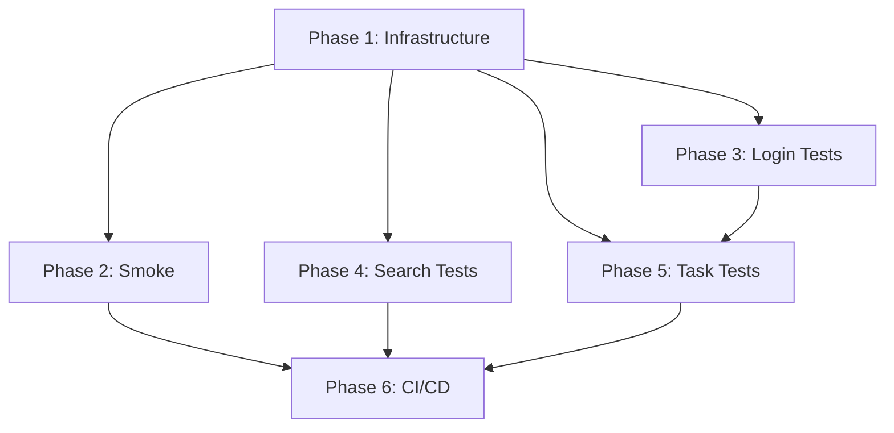

# ROADMAP

**Project:** RewardsCore E2E & Smoke Test Suite
**Branch:** feature/e2e-testing
**Created:** 2026-03-21

---

## Overview

6 phases. 8 requirements mapped. All v1 covered ✓

## Milestone: M1 - Smoke Tests Ready

### Phase 1: Test Infrastructure & Data Setup

**Goal:** Establish decoupled E2E test framework with fixtures, utilities, and test data management.

**Plans:** 3 plan(s)

**REQ IDs:** E2E-001, E2E-008

**Depends on:** None

**Deliverables:**
- [x] 01-01-PLAN.md — Playwright + pytest-asyncio framework setup
- [x] 01-02-PLAN.md — Fixtures for browser contexts, pages, test accounts
- [ ] 01-03-PLAN.md — Test data management (fixtures, mock accounts, storage states)

**Success Criteria:**
- [ ] Tests can spawn isolated browser contexts with automatic cleanup
- [ ] Test fixtures provide reusable browser/page/admin_logged_in instances
- [ ] Test accounts and credentials loaded from CI secrets/env vars
- [ ] Storage state handling supports both fresh sessions and pre-saved logins
- [ ] Screenshot/log capture automatic on test failure
- [ ] Test data files organized in `tests/fixtures/` and `tests/e2e/data/`

---

### Phase 2: Smoke Test Suite

**Goal:** Fast (< 30s) validation covering browser launch, navigation, basic login, and search flows.

**Plans:** 2 plan(s)

**REQ IDs:** E2E-002

**Depends on:** Phase 1

**Deliverables:**
- [ ] 02-01-PLAN.md — Browser launch and basic navigation tests
- [ ] 02-02-PLAN.md — Smoke coverage: login (quick), search (minimal), health checks

**Success Criteria:**
- [ ] Entire smoke suite executes in < 30 seconds (headless, no external delays)
- [ ] Smoke pass rate ≥ 95% (≤ 1 failure per 20 runs)
- [ ] Tests detect browser/Playwright installation issues immediately
- [ ] Smoke tests can run locally with `pytest tests/e2e/smoke/ -v`
- [ ] Clear pass/fail summary with duration metrics printed at end
- [ ] Failures auto-capture screenshots and console logs to `logs/e2e/`

---

### Phase 3: Login E2E Tests

**Goal:** Comprehensive independent login validation (90%+ success rate) including 2FA, sessions, errors, logout.

**Plans:** 3 plan(s)

**REQ IDs:** E2E-003

**Depends on:** Phase 1

**Deliverables:**
- [ ] 03-01-PLAN.md — Standard login and session recovery tests
- [ ] 03-02-PLAN.md — 2FA/TOTP and edge case tests
- [ ] 03-03-PLAN.md — Error handling and logout tests

**Success Criteria:**
- [ ] Login tests run independently—no dependency on search or tasks
- [ ] Standard login pass rate ≥ 90% on real accounts (retries allowed ≤ 1)
- [ ] 2FA/TOTP flow works end-to-end with test secret
- [ ] Session recovery test verifies storage_state.json reuse
- [ ] Error scenarios handled: wrong password, account locked, network timeout
- [ ] Logout test confirms session invalidation and re-login requirement
- [ ] Tests tolerant to ≤ 2min network delays (configurable timeout)
- [ ] Each test cleans up context completely; no leakage between runs

---

### Phase 4: Search E2E Tests

**Goal:** Search workflow validation in both no-login and with-login modes achieving ≥ 85% success rate.

**Plans:** 3 plan(s)

**REQ IDs:** E2E-004, E2E-005

**Depends on:** Phase 1

**Deliverables:**
- [ ] 04-01-PLAN.md — No-login desktop search tests (default mode)
- [ ] 04-02-PLAN.md — With-login search tests (session required)
- [ ] 04-03-PLAN.md — Search verification and error handling tests

**Success Criteria:**
- [ ] No-login search tests complete without any account credentials
- [ ] Search pass rate ≥ 85% (real Bing search, points detection validated)
- [ ] With-login mode can be optionally skipped if account unavailable (mark skipped, not fail)
- [ ] Mobile search simulation test uses device descriptor and verifies mobile UI
- [ ] Search verification confirms points increment after each search
- [ ] Error handling: search failure, network timeout, Bing UI change detection
- [ ] Tests parameterized to run 1–5 searches per test (configurable)
- [ ] Result JSON includes search terms used, points earned, timestamps

---

### Phase 5: Task E2E Tests

**Goal:** Task discovery and execution validation covering URL rewards, quizzes, polls (self-contained scenarios).

**Plans:** 2 plan(s)

**REQ IDs:** E2E-006

**Depends on:** Phase 3 (login required for tasks)

**Deliverables:**
- [ ] 05-01-PLAN.md — Task discovery and URL reward tests
- [ ] 05-02-PLAN.md — Quiz and poll task tests

**Success Criteria:**
- [ ] Task discovery test finds ≥ 3 available tasks from rewards.bing.com
- [ ] URL reward test completes at least 1 external link visit and returns to rewards
- [ ] Quiz test completes multi-step question flow and submits successfully
- [ ] Poll test selects option and records completion
- [ ] All task tests run only after successful login (fixture dependency)
- [ ] Tests verify task completion by checking green checkmark or success message
- [ ] Failures include page URL, screenshot, and DOM snapshot for debugging
- [ ] Tests tolerant of missing tasks (mark skipped if no tasks available, not fail)

---

### Phase 6: CI/CD Integration

**Goal:** GitHub Actions workflows and reporting pipeline for daily automated execution with artifacts and alerts.

**Plans:** 2 plan(s)

**REQ IDs:** E2E-007

**Depends on:** Phases 2, 3, 4, 5

**Deliverables:**
- [ ] 06-01-PLAN.md — GitHub Actions workflows: smoke (daily) and full (weekly)
- [ ] 06-02-PLAN.md — Artifacts, reports, and failure notifications

**Success Criteria:**
- [ ] Smoke workflow runs daily (UTC 00:00) on `feature/e2e-testing` branch
- [ ] Full E2E workflow runs weekly (Sunday UTC 01:00) with all tests
- [ ] CI uses Playwright's setup-action to install browsers and dependencies
- [ ] Test reports (JUnit XML) and screenshots uploaded as workflow artifacts
- [ ] Failed runs post comment on PR or send email/sec webhook notification
- [ ] CI secrets (`MS_REWARDS_E2E_*`) documented in `.github/workflows/README.md`
- [ ] Local run parity: same `pytest` command works locally and in CI
- [ ] Workflows cache Playwright browsers between runs to reduce cost/time

---

## Phase Interdependencies

**Key dependencies:**
- Phase 1 is foundational; all others depend on it
- Phase 5 depends on Phase 3 (tasks require login)
- Phase 6 integrates all completed test suites

---

## Progress Tracking

| Phase | Plans Complete | Status | Completed |
|-------|----------------|--------|-----------|
| 1. Infrastructure & Data | 3/3 | 📋 Planned | 2 of 3 complete (01-01, 01-02) |
| 2. Smoke Tests | 2/2 | 📋 Planned | ✅ |
| 3. Login E2E Tests | 3/3 | 📋 Planned | ✅ |
| 4. Search E2E Tests | 3/3 | 📋 Planned | ✅ |
| 5. Task E2E Tests | 2/2 | 📋 Planned | ✅ |
| 6. CI/CD Integration | 2/2 | 📋 Planned | ✅ |

**Total progress:** 2/15 plans (13%) 🟡

---

## Quality Gates

| Phase | Gate | Criteria |
|-------|------|----------|
| 1 | Infrastructure Ready | `pytest tests/e2e/smoke/ --collect-only` succeeds; fixtures load without error |
| 2 | Smoke Passing | `pytest tests/e2e/smoke/ -v` passes with ≥95% rate locally (5 runs) |
| 3 | Login Stable | Login tests pass ≥90% on real account (10 runs) |
| 4 | Search Validated | No-login search pass ≥85%; with-login optional |
| 5 | Tasks Working | Task tests complete without dependency errors |
| 6 | CI Green | All workflows pass on GitHub Actions for 3 consecutive days |

---

## Risk Mitigations

| Risk | Probability | Impact | Mitigation |
|------|-------------|--------|------------|
| Bing UI changes break selectors | Medium | High | Use robust selectors; add screenshots; weekly health check |
| Account lockout due to frequent E2E runs | Low | High | Limit daily runs; use dedicated test account; staggered schedule |
| Network instability causing flaky tests | Medium | Medium | Configurable timeouts; retry logic (≤1); detailed logs |
| CI secrets misconfiguration | Medium | High | Document `.env.example`; local validation script |
| Playwright version drift | Low | Medium | Pin versions in `pyproject.toml`; CI uses same install |

---

*Last Updated: 2026-03-21*
